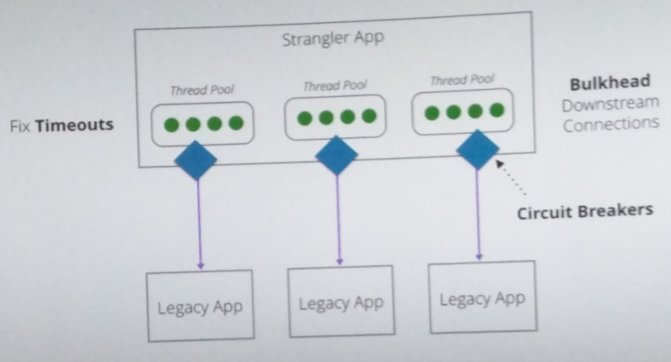

<!--- comments

-->

*SurfWatch* - Angular2/NodeJS app in progress...
================================================

TODO:
-----
* Add user based security https://www.firebase.com/docs/security/guide/user-security.html
* Auth0 implementation => https://auth0.com/blog/2015/05/14/creating-your-first-real-world-angular-2-app-from-authentication-to-calling-an-api-and-everything-in-between/
* Implement Swagger
* Break into micro services if possible
* Use correlation ID's (e.g. on button click... pass ID through services)
* Centralised logs (Kibana, prometheus...) in own container
* Kubernetes
* Think in ctx of services... a user in 1 ctx <> another ctx, don't pass all data everywhere

DONE:
-----
* egghead.io lessons => https://egghead.io/series/angular-2-fundamentals
